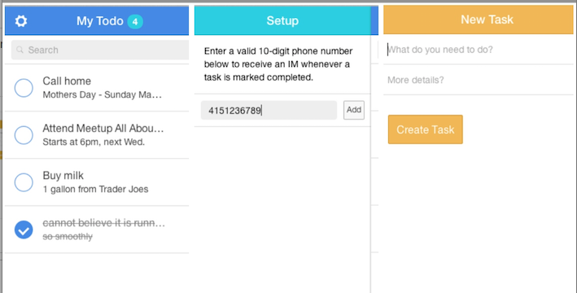

MEANI-todo
==========

## A full stack implementation of a to-do application with MongoDB, Express, AngularJS, Node and Ionic (MEANI)



### Major Components:
- **M** : [MongoDB](http://mongodb.com) - The data persistence layer behind the web server.
- **E** : [Express](http://expressjs.com) - The web server.
- **A** : [AngularJS](http://angularjs.org) - The front-end framework that powers the Single Page App.
- **N** : [Node.js](http://nodejs.org) - The platform for running server Javascript
- **I** : [Ionic](http://ionicframework.com) - The UI framework on top of Angular

### Additional Components:
- [Twilio](http://twilio.com) - The messaging service
- [MongoHQ](http://mongohq.com) - The MongoDB outfitter
- [Mocha](https://github.com/visionmedia/mocha) - The Javascript test framework.


> :octocat: **Live Demo**: http://meani-todo.herokuapp.com
(* Best with desktop Chrome browser)


### To run the app locally:
  1. Clone this repo
  - Copy app/configs-sample.js to app/configs.js
  - Customize your setting at app/configs.js
  - $ npm install
  - $ node server.js

### Known issue:

  - The App is fully tested on Google Chrome browser.
    Other browser platforms are not supported yet.


Implementation Notes:
---------------------

### File Overview:
```

+ server.js              //server bootstrap
  |
  - app                  //server
  | + index.js           //Server instantiation, event registration
  | + routes.js          //URI routing configuration
  | + environment.js     //App setting for different environments
  | + configs.js         //Configuration parameters (customized from configs-example.js)
  | - model
  |   + Task.js          //Business object
  | - sevice
  |   + Messenger.js     //Wrapper to Twilio SMS agent
  |
  - public
  | + index.jade         //Layout and directives for SPA
  | - js
  |   + task.js          //Angular controller and factory
  |   + lib/**           //3rd party JS modules
  | - css
  |   + task.styl        //Custom styling
  |   + lib/**           //3rd party CSS library
  |
  - test
  | + test-server.js     //Mocha API test

```

### API Spec (See [routes.js](./app/routes.js))

Verb |  URI  |   Description  |  Status Code
-----|-------| ---------------| --------
POST | /task | Add a task (request body) to the server | 201: success; 500: server error
GET  | /task | Fetch all tasks | 200: success; 404: no tasks returned; 500: server error
GET  | /task?title=:title&body=:body | Search for tasks that match title and body | 200: success; 204: no tasks returned; 500: server error
GET  | /task/:id | Return task that has id | 200: success; 204: no tasks returned; 500: server error
PATCH | /task/:id | Update the task referenced by id with the request body | 204: success; 500: server error
DELETE | /task/:id | Remove the task referenced by id | 204: success; 500: server error
PUT | /task/:id/completed | Mark the task referenced by id as completed | 200: success; 500: server error
PUT | /task/:id/reset | Mark the task referenced by id as incomplete | 200: success; 500: server error
